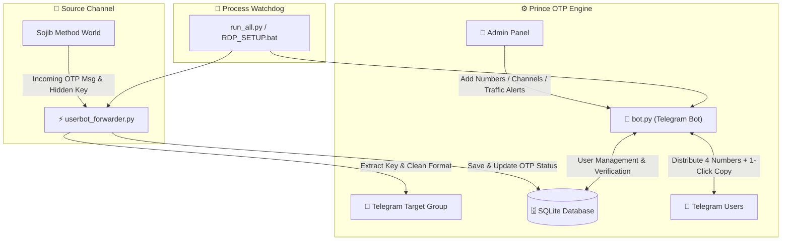

<div align="center">

# 👑 PRINCE OTP BOT & HIGH-SPEED FORWARDER SYSTEM ⚡

[](https://www.python.org/)
[](https://core.telegram.org/bots)
[](https://docs.telethon.dev/)
[](https://www.sqlite.org/)
[](https://github.com)
[](https://github.com)

<br/>

> 🚀 **An Ultra-Fast, Automated WhatsApp OTP Distribution & Smart Telegram Forwarding Ecosystem with 1-Click Native Copy, Hidden Key Extraction, Admin Management Panel & Instant RDP Deployment.**

</div>

---

## 📑 সূচিপত্র / Table of Contents

- [✨ মূল বৈশিষ্ট্যসমূহ (Key Features)](#-মূল-বৈশিষ্ট্যসমূহ-key-features)
- [🏗️ সিস্টেম আর্কিটেকচার (Architecture Flow)](#️-সিস্টেম-আর্কিটেকচার-architecture-flow)
- [📂 ফাইল ও প্রজেক্ট স্ট্রাকচার (Project Structure)](#-ফাইল-ও-প্রজেক্ট-স্ট্রাকচার-project-structure)
- [⚙️ কনফিগারেশন সেটিংস (Configuration)](#️-কনফিগারেশন-সেটিংস-configuration)
- [🚀 ইনস্টলেশন ও রান করার নিয়ম (Installation & Setup)](#-ইনস্টলেশন-ও-রান-করার-নিয়ম-installation--setup)
  - [🖥️ পদ্ধতি ১: আরডিপি (Windows RDP) ১-ক্লিক সেটআপ](#️-পদ্ধতি-১-আরডিপি-windows-rdp-১-ক্লিক-সেটআপ)
  - [💻 পদ্ধতি ২: ম্যানুয়াল রান (Manual Run)](#-পদ্ধতি-২-ম্যানুয়াল-রান-manual-run)
- [👑 অ্যাডমিন প্যানেল ও কমান্ডসমূহ (Admin Features)](#-অ্যাডমিন-প্যানেল-ও-কমান্ডসমূহ-admin-features)
- [🛡️ নিরাপত্তা ও অপ্টিমাইজেশন (Security & Reliability)](#️-নিরাপত্তা-ও-অপ্টিমাইজেশন-security--reliability)

---

## ✨ মূল বৈশিষ্ট্যসমূহ (Key Features)

### 🤖 ১. স্মার্ট ইউজার বট (Prince OTP Bot)
* **🔥 মাল্টিপল নম্বর বিতরণ:** ব্যবহারকারী প্রতি রিকোয়েস্টে এক সাথে **৪টি সতেজ নম্বর** পায়।
* **📋 ১-ক্লিক নেটিভ কপি বাটন:** টেলিগ্রামের সর্বশেষ `CopyTextButton` টেকনোলজির মাধ্যমে যেকোনো নম্বরের উপর ক্লিক করলেই তা সাথে সাথে কপি হয়ে যায়।
* **🌐 কান্ট্রি ভিত্তিক গ্রিড:** রিয়েলটাইম স্টক কাউন্ট সহ ডায়নামিক ২-কলাম কান্ট্রি সিলেকশন মেন্যু।
* **🔍 সিরিয়াল ও হিস্ট্রি সার্চ:** ব্যবহারকারীরা পূর্বে নেওয়া নম্বরের ওটিপি কোড ও স্ট্যাটাস যেকোনো সময় দেখতে পারে।

### ⚡ ২. লাইভ ওটিপি ইউজারবট ফরওয়ার্ডার (Userbot Forwarder)
* **🕵️ হিডেন ওটিপি কী এক্সট্রাকশন:** সোর্স মেসেজের ইনলাইন বাটনের আড়ালে লুকানো আলফা-নিউমেরিক OTP Key স্বয়ংক্রিয়ভাবে শনাক্ত ও বের করে নেওয়া।
* **🎨 ক্লিন মেসেজ পোস্টিং:** কোনো সোর্স চ্যানেলের নাম বা `Forwarded from` হেডার ছাড়াই নিজস্ব ব্র্যান্ডিং (`🔑 📋 Copy Your Key`, `🤖 Get Number`, `📢 Channel`) দিয়ে গ্রুপে পোস্ট করা।
* **⚡ শূন্য লেটেন্সি (Real-time Delivery):** ওটিপি আসার সাথে সাথে মিলিসেকেন্ডের মধ্যে ওটিপি গ্রুপে ডেলিভারি।

### 📢 ৩. ফোর্স জয়েন ভেরিফিকেশন সিস্টেম (Force Join Protection)
* ব্যবহারকারীকে নম্বর নেওয়ার পূর্বে অ্যাডমিনের নির্ধারিত টেলিগ্রাম চ্যানেল ও গ্রুপগুলোতে জয়েন করতে হবে।
* **ডাটাবেস ট্র্যাকিং (`user_verified`):** একবার ভেরিফিকেশন সফল হলে ডাটাবেসে স্থায়ীভাবে সেভ থাকে, ফলে বারবার জয়েন অপশন এসে ব্যবহারকারীকে বিরক্ত করে না।
* অ্যাডমিনদের জন্য অটোমেটিক বাইপাস সুবিধা।

### 📊 ৪. অ্যাডমিন কন্ট্রোল ও অটো ব্রডকাস্ট
* **📦 অটো স্টক নোটিফিকেশন:** অ্যাডমিন প্যানেল থেকে নতুন নম্বর যোগ করার সাথে সাথে সমস্ত ইউজারের ইনবক্সে এবং ওটিপি গ্রুপে স্বয়ংক্রিয় ব্রডকাস্ট।
* **🚦 হাই ট্রাফিক অ্যালার্ট:** নির্দিষ্ট দেশ বা কাস্টম মেসেজ সহ হাই ট্রাফিকের সময় ইউজারদের দ্রুত এলার্ট পাঠানোর ব্যবস্থা।
* **📁 টেক্সট ফাইল আপলোড:** `.txt` ফাইল আপলোড করে এক ক্লিকে হাজার হাজার নম্বর স্টকে যুক্ত করার সুবিধা।

---

## 🏗️ সিস্টেম আর্কিটেকচার (Architecture Flow)



---

## 📂 ফাইল ও প্রজেক্ট স্ট্রাকচার (Project Structure)

```text
📦 OtpBot/
├── 🤖 bot.py                 # প্রধান টেলিগ্রাম বট ও অ্যাডমিন প্যানেল হ্যান্ডলার
├── ⚡ userbot_forwarder.py   # টেলিথন ভিত্তিক লাইভ ওটিপি ফরওয়ার্ডার ও কী এক্সট্রাক্টর
├── 🚀 run_all.py             # মাস্টার রানার এবং প্রসেস ওয়াচডগ (Auto-Restart Monitor)
├── 📜 RDP_SETUP.bat          # আরডিপিতে ১-ক্লিকে ইনস্টল ও চালু করার স্ক্রিপ্ট
├── 📋 requirements.txt       # প্রয়োজনীয় পাইথন প্যাকেজের তালিকা
├── 📖 RDP_GUIDE.txt          # আরডিপি ব্যবহারের পূর্ণাঙ্গ নির্দেশিকা
├── 🎨 prompt.txt             # ৩টি প্রিমিয়াম এআই ইমেজ জেনারেশন প্রম্পট
└── 🗄️ otp_bot.db            # স্বয়ংক্রিয় SQLite ডাটাবেস (Auto-Generated)
```

---

## ⚙️ কনফিগারেশন সেটিংস (Configuration)

বটের ফাইলগুলোতে প্রয়োজনীয় আইডি ও টোকেনগুলো সুরক্ষিতভাবে সেট করা রয়েছে:

| ভ্যারিয়েবল (Variable) | বিবরণ (Description) | অবস্থান (File) |
| :--- | :--- | :--- |
| `BOT_TOKEN` | মেইন টেলিগ্রাম বট টোকেন | `bot.py` |
| `FORWARDER_BOT_TOKEN` | ওটিপি গ্রুপে ফরওয়ার্ড করার বট টোকেন | `bot.py` / `userbot_forwarder.py` |
| `ADMIN_ID` | অ্যাডমিন টেলিগ্রাম আইডি (`6529326938`) | `bot.py` |
| `SOURCE_CHANNEL_ID` | যে চ্যানেল থেকে ওটিপি আসবে (`-1002237834710`) | `userbot_forwarder.py` |
| `TARGET_GROUP_ID` | যে গ্রুপে ওটিপি ফরওয়ার্ড হবে (`-1002360877963`) | `userbot_forwarder.py` / `bot.py` |
| `API_ID` & `API_HASH` | টেলিগ্রাম ক্লায়েন্ট এপিআই ক্রেডেনশিয়ালস | `userbot_forwarder.py` / `run_all.py` |

---

## 🚀 ইনস্টলেশন ও রান করার নিয়ম (Installation & Setup)

### 🖥️ পদ্ধতি ১: আরডিপি (Windows RDP) ১-ক্লিক সেটআপ

1. সম্পূর্ণ **OtpBot** ফোল্ডারটি আপনার আরডিপিতে কপি করে রাখুন।
2. আরডিপিতে পাইথন ইনস্টল না থাকলে [Python.org](https://www.python.org/downloads/) থেকে ইনস্টল করুন (ইনস্টলের সময় অবশ্যই **`☑ Add Python to PATH`** সিলেক্ট করবেন)।
3. **`RDP_SETUP.bat`** ফাইলের উপর ডাবল ক্লিক করুন!
   * এটি প্রয়োজনীয় সব লাইব্রেরি ইনস্টল করে স্বয়ংক্রিয়ভাবে বট ও ফরওয়ার্ড চালু করে দিবে।

---

### 💻 পদ্ধতি ২: ম্যানুয়াল রান (Manual Run)

#### ১. রিপোজিটরি ক্লোন বা ফোল্ডারে প্রবেশ করুন:
```bash
cd OtpBot
```

#### ২. ডিপেন্ডেন্সি ইনস্টল করুন:
```bash
pip install -r requirements.txt
```

#### ৩. মাস্টার রানার দিয়ে সম্পূর্ণ সিস্টেম চালু করুন:
```bash
python run_all.py
```

---

## 👑 অ্যাডমিন প্যানেল ও কমান্ডসমূহ (Admin Features)

টেলিগ্রাম বটে অ্যাডমিন আইডি থেকে `/admin` কমান্ড দিয়ে সম্পূর্ণ বট নিয়ন্ত্রণ করা যায়:

| ফিচার (Feature) | বর্ণনা (Description) |
| :--- | :--- |
| ➕ **Add Country** | নতুন যেকোনো দেশ যুক্ত করা (যেমন: Sudan, Togo, Ukraine)। |
| 📱 **Add Numbers** | মেসেজ লিখে বা সরাসরি `.txt` ফাইল আপলোড করে শত শত নম্বর স্টকে যোগ করা। |
| 📊 **View Stock** | রিয়েলটাইমে কোন দেশের কয়টি নম্বর খালি আছে তা দেখা। |
| 🚦 **Traffic Alert** | ইউজারদের হাই ট্রাফিক নোটিফিকেশন পাঠানো। |
| 📢 **Force Join** | নতুন কোনো গ্রুপ বা চ্যানেল বাধ্যতামূলক জয়েন লিস্টে যোগ/ডিলিট করা। |
| 📢 **Broadcast** | বটের সকল সক্রিয় ব্যবহারকারীকে সরাসরি মেসেজ পাঠানো। |

---

## 🛡️ নিরাপত্তা ও অপ্টিমাইজেশন (Security & Reliability)

* 🔄 **প্রসেস অটো-রিস্টার্ট ওয়াচডগ (`run_all.py`):** কোনো কারণে বট বা ফরওয়ার্ডার বন্ধ হয়ে গেলে এটি তাৎক্ষণিকভাবে পুনরায় রিস্টার্ট করে দেয়।
* 🌐 **UTF-8 এনকোডিং ফিক্স:** উইন্ডোজ বা আরডিপিতে ইমোজি বা বাংলা টেক্সটের ক্র্যাশ হওয়া সম্পূর্ণ দূর করতে `PYTHONIOENCODING=utf-8` এনকোডার যুক্ত।
* 💾 **স্মার্ট ক্লিয়ারিং ও ক্লিনআপ:** ব্যবহৃত নম্বর ও ভেরিফাইড ইউজারদের ডাটাবেস হ্যান্ডলিং অপ্টিমাইজড।

---

<div align="center">

### 👑 Powered by PRINCE OTP SYSTEM ⚡
*Developed with High Performance & Scalability in Mind.*

</div>
